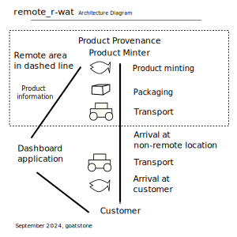

<h1> Remote Real-World Asset Token</h1>

## remote_r-wat

#### Remote Real-World Asset Token is hosted at the URL:

[https://joseherminiocollas.github.io/remote_r-wat/](https://joseherminiocollas.github.io/remote_r-wat/)

#### Code Repository

<a href="https://github.com/JoseHerminioCollas/remote_r-wat">https://github.com/JoseHerminioCollas/remote_r-wat</a>

The objective of remote_r-wat (Remote Real-World Asset Token) is to establish processes and systems for real-world tokenization in remote locations of the world, specifically the mountain region of the Andes.

Remote locations are the source of many assets, however the conditions there may not be suited to minting tokens. Minting real-world assets in remote locations is not a specific objective of many solutions that exist today. Remote locations provide distinct challenges such as no power or no internet. The Andean region offers a variety of products that can benefit from tokenization such as minerals and foods.

In the case of foods, the route to the customer may not be suited to its preservation.
Each step along the journey can be recorded to ensure the integrity of the product throughout its journey.

In the case of minerals, Peruvian law requires the verification of the lawful origin of the mineral.
The minting of minerals at their provenance should establish this verification. Information such as mining rights can be recorded in the minting process.

Jose Collas is well suited to understanding the region because of his Peruvian citizenship as well as his longtime involvement in the region. Jose has years of development work and looks forward to continuing his work using Hedera.

The target leger system used will be Hedera. Hedera has the potential to be, in the future, the established leger solution for the problems that are to be solved here.

Some of the key characteristics of Hedera that set it up for the long term are its low fees, efficiency (Hashgraph Consensus Algorithm) and organization setup. The Hedera Foundation is likely to be the same years to come. It is unlikely that Hedera would be purchased by another company then changed. 

Developers on the team have experience with Hedera as a result of participating in several Hedera hackathons.

The launch date for the project is April 1, 2025

### The Competitors

remote_r-wat is a system and software application to create real-world asset tokens.
The distinct quality of this application is its focus on the tokenization of products in remote locations.

Currently, there are several <em>platforms</em> that offer the basis for a real-world asset tokenization application. These platforms are general purpose platforms such as <a href="https://www.venly.io"> venly.io </a> and <a href="https://www.fireblocks.com/"> fireblocks.com </a>.

These platforms can be utilized to mint products in remote locations however, these platforms do not consider the distinct characteristics of products in remote locations. The real estate sector is targeted in specialized applications such as, <a href="https://tokend.io">tokend.io</a> however, there is no consideration of real estate in remote locations. Services, such as Amazons' Track and Trace provide insights into a supply chain that uses blockchain. Track and trace services may be used along with  remote_r-wat and not necessarily compete with remote_r-wat. 

In the current research, <em>no</em> project that specializes in the tokenization of products in remote locations, has been found.

### Demo

[youtube video]

### Architecture Diagram

#### Provenance

A mobile electronic device records initial verification and records conditions.
Characteristics such as weight, size, latitude, longitude, temperature are recorded. The minting is done upon discovery or harvest or is prepared to be taken to a base station that is connected to the internet. The product may require specialized packaging with sensors that will record information onto the blockchain.

#### Track and Trace Dashboard Application

Product information will be available online.
The supplier and customer will be able to view information about the product in the supply chain.

### User Journeys

#### Fish farmers in the Andes.

Upon harvest of the fish, photographs and information about the fish are recorded as part of the token.

The farmer can view the recorded product on an online dashboard application.

The farmer places the fish into a container designed to securely transport the fish to a location where it can be refrigerated. In the container are sensors that will record the state of the container and its contents.

Customers view photographs and specifications recorded with the minting of the product on a dashboard application. Customers can view the journey taken with visualizations of maps and lists of records made at each step of the journey.

#### Artisanal Miner.

An artisanal miner has secured mining rights in a remote part of the Andes.
Upon discovery of the mineral, the miner records the discovery. Specialized equipment enables the minting in this area without power or internet.

The mineral discovered will be sold in its natural state. A photograph of the mineral as it was discovered in the earth along with latitudes and longitudes provide information about this natural state. 

The customer observes the product compared to its discovered state, and observes any deformation of the minerals' natural state.

<address>
<a rel="author" href="https://github.com/JoseHerminioCollas">
Jose Collas
</a>
</address>
<time datetime="2024-09-05" title="September, 2024">September, 2024</time>
